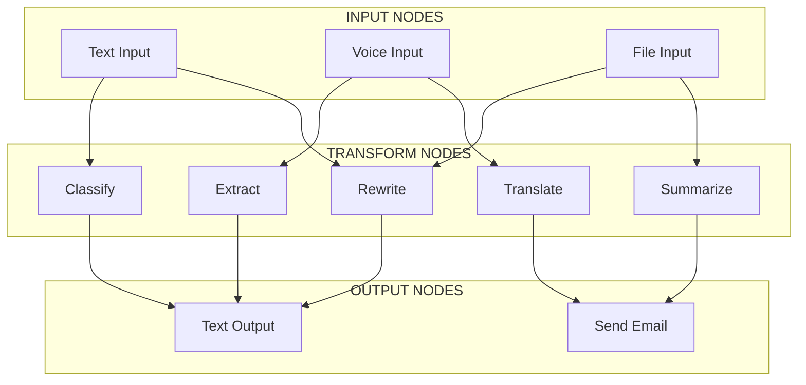
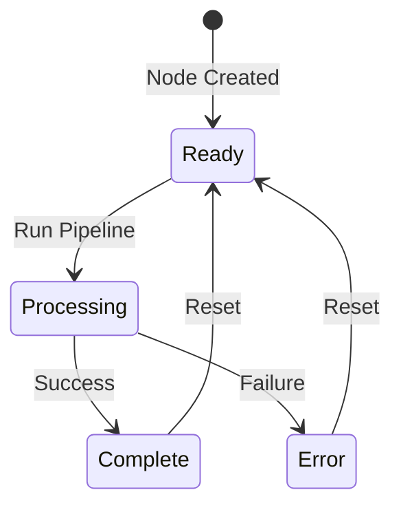

# AI Pipeline Editor

A visual node-based AI pipeline editor for creating and running AI workflows with input, transform, and output nodes.

## Features

- **Visual Node Editor**: Drag-and-drop interface for building AI pipelines
- **Multiple Input Types**: Text, Voice, and File inputs
- **Transform Nodes**: Rewrite, Classify, Translate, Extract, and Summarize
- **Output Options**: Text output and Email sending
- **Real-time Status**: Visual indicators showing node readiness

## How It Works

The AI Pipeline Editor follows a flow-based architecture where data flows from Input nodes through Transform nodes to Output nodes.

## Architecture & Behavior

## Node Types

| Node Type | Category | Description |
|-----------|----------|-------------|
| Text Input | Input | Accept text data |
| Voice Input | Input | Accept audio/voice data |
| File Input | Input | Accept file uploads |
| Rewrite | Transform | Rewrite content with AI |
| Classify | Transform | Categorize content |
| Translate | Transform | Translate to other languages |
| Extract | Transform | Extract key information |
| Summarize | Transform | Create summaries |
| Text Output | Output | Display text results |
| Send Email | Output | Send results via email |

## Usage

1. Drag nodes from the sidebar onto the canvas
2. Connect nodes by dragging from output ports to input ports
3. Configure nodes using the properties panel
4. Click "Run Pipeline" to execute

## License

MIT License
